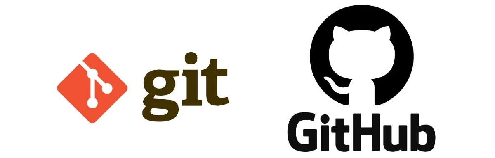

# Bora aprender sobre Git e GitHub?

🔹Playlist sobre git e github:  
[LINK](https://www.youtube.com/playlist?list=PLylCwvNCtoanYEIC4OBMO2hfB-ihCSv9Y)

🔹Ferramenta gráfica para aprender git `Learning Git Branching`:  
[LINK](https://learngitbranching.js.org/?locale=pt_BR&NODEMO=)

## Principais comandos do `git`

- `git status` → Mostra o estado atual do repositório, incluindo arquivos modificados e não rastreados.  
- `git add` → Adiciona arquivos ao staging area para serem incluídos no próximo commit.  
- `git commit` → Salva as mudanças do staging area no repositório com uma mensagem descritiva.  
- `git pull` → Atualiza o repositório local com as últimas mudanças do repositório remoto.  
- `git push` → Envia os commits do repositório local para o repositório remoto.  
- `git branch` → Lista, cria ou exclui branches no repositório.  
- `git checkout` → Alterna entre branches ou restaura arquivos para um estado anterior.